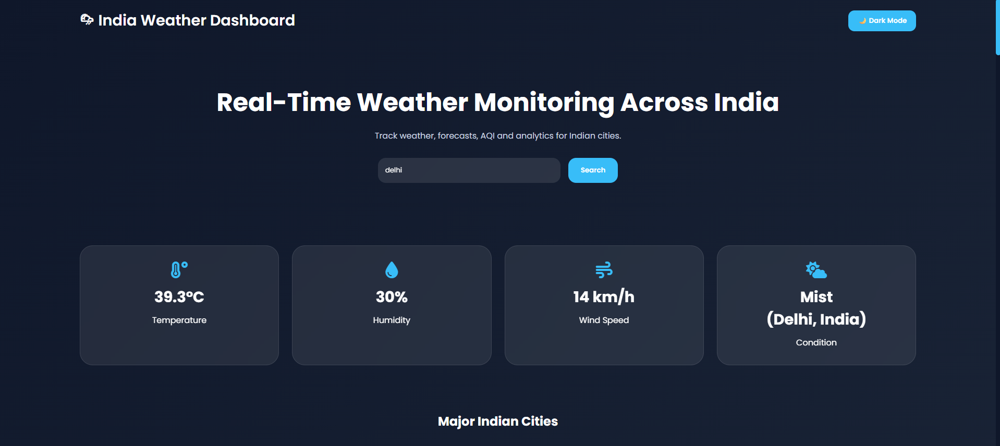

# 🌦 Weather Tracking Tool

A full-stack Weather Tracking Dashboard built using Spring Boot, MySQL, HTML, CSS, JavaScript, and WeatherAPI. The application provides real-time weather information for Indian cities and stores weather records in a MySQL database.

---

## 🚀 Features

* 🌍 Search weather by city name
* 🌡 Real-time temperature monitoring
* 💧 Humidity tracking
* 🌬 Wind speed monitoring
* ☁ Weather condition updates
* 📊 Interactive weather dashboard
* 🗄 MySQL database integration
* 🔗 REST API using Spring Boot
* 📱 Responsive user interface
* 🌙 Dark mode support

---

## 🛠 Technologies Used

### Backend

* Java 21
* Spring Boot
* Spring Data JPA
* Maven
* MySQL

### Frontend

* HTML5
* CSS3
* JavaScript
* Chart.js

### API

* WeatherAPI

---

## 📂 Project Structure

```text
weatherbackend/
│
├── src/
│   ├── main/
│   │   ├── java/
│   │   │   └── com/weather/weatherbackend/
│   │   │       ├── controller/
│   │   │       ├── model/
│   │   │       ├── repository/
│   │   │       ├── service/
│   │   │       └── WeatherbackendApplication.java
│   │   │
│   │   ├── resources/
│   │   │   ├── static/
│   │   │   │   ├── index.html
│   │   │   │   ├── style.css
│   │   │   │   └── script.js
│   │   │   └── application.properties
│
├── pom.xml
├── README.md
└── .gitignore
```

---

## ⚙️ Installation

### Clone Repository

```bash
git clone https://github.com/rojadandu123/weather-tracking-tool.git
cd weather-tracking-tool
```

### Create Database

```sql
CREATE DATABASE weatherdb;
```

### Configure MySQL

Update `application.properties`:

```properties
spring.datasource.url=jdbc:mysql://localhost:3306/weatherdb
spring.datasource.username=root
spring.datasource.password=your_password

spring.jpa.hibernate.ddl-auto=update
spring.jpa.show-sql=true
```

---

## 🔑 API Setup

1. Create a free WeatherAPI account.
2. Generate an API key.
3. Open:

```text
src/main/resources/static/script.js
```

4. Replace:

```javascript
const apiKey = "YOUR_API_KEY";
```

with your actual API key:

```javascript
const apiKey = "YOUR_ACTUAL_API_KEY";
```

5. Save the file.

> **Note:** Never upload your real API key to a public GitHub repository.

---

## ▶️ Run the Application

```bash
mvn spring-boot:run
```

---
# 🌦 Weather Tracking Tool

## Dashboard Preview



## 🌐 Access the Application

Open your browser and visit:

```text
http://localhost:8080
```

---

## 📡 REST API Endpoints

### Get All Weather Records

```http
GET /weather
```

### Save Weather Record

```http
POST /weather
```

Example Request Body:

```json
{
  "city": "Hyderabad",
  "temperature": 35.2,
  "condition": "Partly Cloudy",
  "humidity": 37,
  "windSpeed": 17.6
}
```

---

## 📸 Dashboard Features

* Live weather search
* Real-time temperature updates
* Humidity monitoring
* Wind speed tracking
* Weather condition display
* Database-stored weather history
* Interactive dashboard UI
* Dark mode support

---

## 🔮 Future Enhancements

* 5-Day Weather Forecast
* Air Quality Index (AQI)
* City Autocomplete Suggestions
* Weather Alerts & Notifications
* User Authentication
* Weather Maps Integration

---


Happy Coding! 🚀
